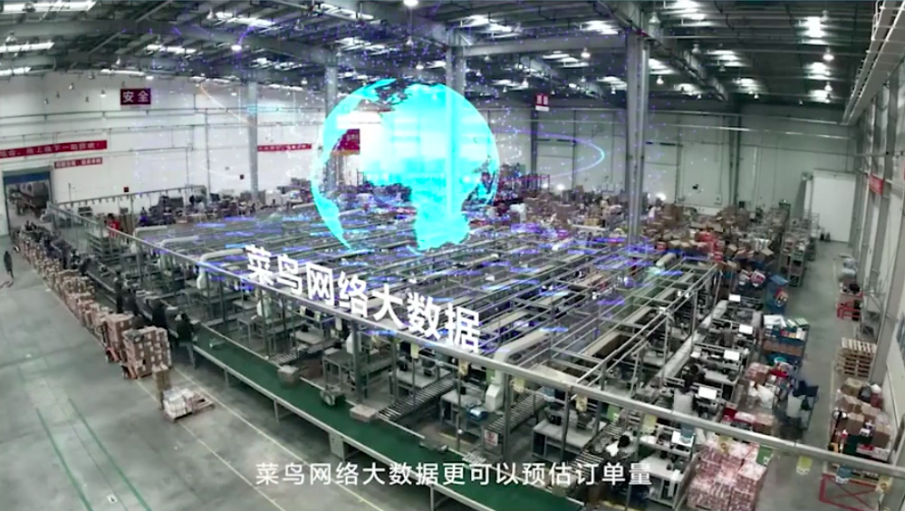
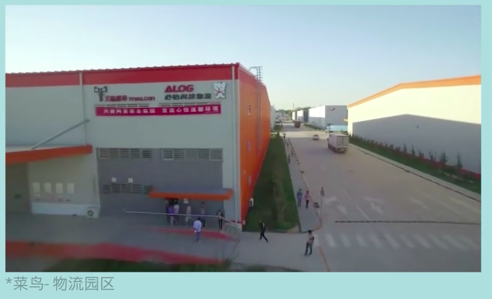

# 2020/04/04
---
# 科技相对论|物流时代
#### 快递！=物流
- 快递小哥 只是最后一公里
- 揽件和快递的最后一公里
- 揽收、运送、配送、分拣
- 物流是一个强运营和高效率的产业

#### 物流 Logistics
- Planning, implementing, and controlling the flow of raw materials, inventory, and finished goods to the point of consumption
- 计划并控制原材料和商品的运输、仓储，并最终让其到达买家手中的过程。

#### RFID 射频识别技术
- 迪卡侬，标签和普通的二维码不同，透明的，还能看到里面有线圈。 这个是射频的识别标签
- RFID ， radio frequency identification , 是一种非接触式的物体识别技术
- RFID也是像Barcode和二维码的一种，通过它，可以实现仓储物流中的无人化管理。 
- 电子标签（包裹，物流object） | 标签读写器 （传送带上，物流分拣，物流包装设备上） | 后台管理系统（运算并返回路径给标签读写器）
- 我是谁，我从哪里来，我要到哪里去。 物流信息。
- RFID，除了物流中有重要的作用，然后就是物联网了。 把整个世界都链接起来（虚拟和现实也可以），比如冰箱，汽车，红绿灯和王者荣耀。 
- 物联网中，身份识别， RFID是其中一种方式。 
- Why RFID， 条码是条（数字英文，货品的名称和价格，几十个字符），二维码是点阵（中文和图片，几百个字节），RFID是芯片（流媒体，几十个KB）.
- RFID是主动的

#### 为什么京东和菜鸟要开战？蜂鸟大战
- 物流数据，是各大电商的必争之地
- 京东模式 VS 菜鸟网络
- 原来的物流模式是，买家下单，然后卖家再下单（给SF or 三通一达）

#### 阻碍全中国人民团结友爱的两个因素
- 1. 北方供暖
- 2. 江浙沪包邮
- 两边正吵的不可开交的时候，徐州说，我既供暖又包邮。。。

#### 京东的自建物流体系
- 和亚马孙学的，核心是区域仓储。
- 数据驱动，自动补货。
- 物流的快速稳定，强化了优势的3C项目
#### 菜鸟网络
- 菜鸟并不是一个物流公司，而是一个**大数据信息平台**。整合快递的平台。 
- 三张网，天网、地网、人网。
- 天网，依托阿里巴巴的网络，预测需求量，提前备货，减少高峰期的仓库压力

 
- 地网，线下的物流园区，整合各个物流仓储公司，圈起来。提高效率。缩短运输距离，来对抗京东的区域仓储。

 
- 人网，面向消费者的服务，比如进到各个小区的菜鸟驿站，解决配送的问题。
- 以上3网，本质上是用阿里的大数据驱动。
- 野心太大，菜鸟对物流供应商评级，金银铜铁，根据质量等级分配订单，油水大的给金银，而铜铁甚至没有订单。 菜鸟成为了规则的制定者，也是利益的分配者。 掌握了全部的话语权。 
- 所以除了圆通（菜鸟投资），剩下的两通一达，就搞了个丰巢（快递柜），来对抗菜鸟。